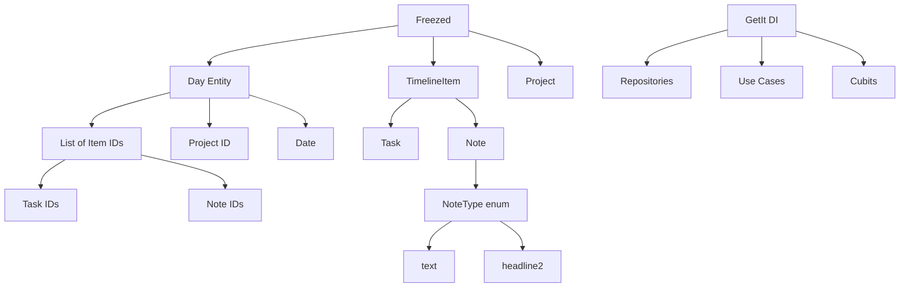

# Clean Architecture for Gradus

## Overview
Gradus is a timeline-first planner with infinite side-scroll week where tasks, notes, and ideas live together. The architecture is based on Clean Architecture principles with Cubits, ensuring layer separation and testability.

## Layer Structure
**Pages → Widgets → Cubits → Use Cases → Repositories → Data Sources**

### Core Principles:
- Repositories and use cases always return `Either<Failure, T>` for error handling
- Repositories expose streams for real-time updates
- Cubits listen to streams from use cases

## Main Application Domains

### 1. Timeline
- **Days** - each day has assigned notes and tasks with sorting responsibility
- Infinite side-scroll through weeks
- Drag & drop functionality, also between days
- Days are filtered by project

### 2. Tasks
- Recurring tasks
- Deadlines
- Task description
- Assignment to project

### 3. Notes
- Headlines and text content with formatting types
- Assignment to project
- Support for different note types (text, headline2)

### 4. Projects
- Projects as work contexts (Personal, Work, etc.)
- Timeline filtering by projects
- Customizable projects
- Every item (task/note) has assigned project
- Always must be at least one project (Personal and Work are created by default)
- Switching project reloads timeline with new items

### 5. Sync
- Handled by Firestore as data source

## Architecture Diagram



## Key Data Models

### Day Entity
```dart
@freezed
class Day with _$Day {
  const factory Day({
    required DateTime date,
    required String projectId,
    required List<String> itemIds, // Sorting responsibility - order matters
  }) = _Day;
  
  factory Day.fromJson(Map<String, dynamic> json) => _$DayFromJson(json);
}
```

### TimelineItem Entity (abstract)
```dart
@freezed
abstract class TimelineItem with _$TimelineItem {
  const factory TimelineItem({
    required String id,
    required String projectId,
    required DateTime createdAt,
    required DateTime updatedAt,
  }) = _TimelineItem;
  
  factory TimelineItem.fromJson(Map<String, dynamic> json) => _$TimelineItemFromJson(json);
}
```

### Task Entity
```dart
@freezed
class Task extends TimelineItem with _$Task {
  const factory Task({
    required String id,
    required String projectId,
    required DateTime createdAt,
    required DateTime updatedAt,
    required String title,
    @Default(false) bool isCompleted,
    required DateTime date,
    String? description,
    RecurrenceRule? recurrence,
  }) = _Task;
  
  factory Task.fromJson(Map<String, dynamic> json) => _$TaskFromJson(json);
}
```

### Note Entity
```dart
@freezed
class Note extends TimelineItem with _$Note {
  const factory Note({
    required String id,
    required String projectId,
    required DateTime createdAt,
    required DateTime updatedAt,
    required String content,
    @Default(NoteType.text) NoteType type,
  }) = _Note;
  
  factory Note.fromJson(Map<String, dynamic> json) => _$NoteFromJson(json);
}

enum NoteType {
  text,
  headline1,
  headline2,
  headline3
}
```

### Project Entity
```dart
@freezed
class Project with _$Project {
  const factory Project({
    required String id,
    required String name,
    required DateTime createdAt,
  }) = _Project;
  
  factory Project.fromJson(Map<String, dynamic> json) => _$ProjectFromJson(json);
}
```

## Pattern Examples

### Repository Pattern
```dart
abstract class TasksRepository {
  Stream<Either<Failure, List<Task>>> watchTasks({String? projectId});
  Future<Either<Failure, Unit>> createTask(Task task);
  Future<Either<Failure, Unit>> updateTask(Task task);
  Future<Either<Failure, Unit>> deleteTask(String taskId);
}
```

### Use Case Pattern
```dart
@injectable
class WatchTasksUseCase {
  final TasksRepository repository;
  
  WatchTasksUseCase(this.repository);
  
  Stream<Either<Failure, List<Task>>> call({String? projectId}) {
    return repository.watchTasks(projectId: projectId);
  }
}
```

### Cubit Pattern
```dart
@injectable
class TasksCubit extends Cubit<TasksState> {
  final WatchTasksUseCase _watchTasksUseCase;
  final CreateTaskUseCase _createTaskUseCase;
  
  TasksCubit(
    this._watchTasksUseCase,
    this._createTaskUseCase,
  ) : super(const TasksInitial());
  
  void watchTasks({String? projectId}) {
    _watchTasksUseCase(projectId: projectId).listen((either) {
      either.fold(
        (failure) => emit(TasksError(failure)),
        (tasks) => emit(TasksLoaded(tasks)),
      );
    });
  }
}
```

## Dependency Injection

Using GetIt with Injectable for DI:
```dart
// Repositories
@LazySingleton(as: TasksRepository)
class TasksRepositoryImpl implements TasksRepository {
  final TasksDataSource tasksDataSource;
  
  TasksRepositoryImpl({
    required this.tasksDataSource,
  });
}

// Use Cases
@injectable
class WatchTasksUseCase {
  final TasksRepository repository;
  WatchTasksUseCase(this.repository);
}

// Cubits
@injectable
class TasksCubit extends Cubit<TasksState> {
  final WatchTasksUseCase watchTasksUseCase;
  final CreateTaskUseCase createTaskUseCase;
  
  TasksCubit({
    required this.watchTasksUseCase,
    required this.createTaskUseCase,
  }) : super(const TasksInitial());
}
```

Run code generation:
```bash
dart run build_runner build --delete-conflicting-outputs
```

## Sorting Strategy

The Day entity is responsible for maintaining the order of timeline items through the `itemIds` list. The order of IDs in this list determines the display order:

1. **Adding items**: New items are appended to the end of `itemIds`
2. **Reordering**: Drag & drop operations modify the `itemIds` list order
3. **Cross-day moves**: Remove ID from source day, add to target day at desired position
4. **Rendering**: UI components iterate through `itemIds` and fetch corresponding items

This approach provides:
- Clear separation of concerns (Day handles ordering)
- Efficient reordering operations
- Consistent state management
- Easy drag & drop implementation