# Gradus - Architecture Diagrams

This document provides visual representations of the Gradus application architecture using Mermaid diagrams.

## Clean Architecture Overview

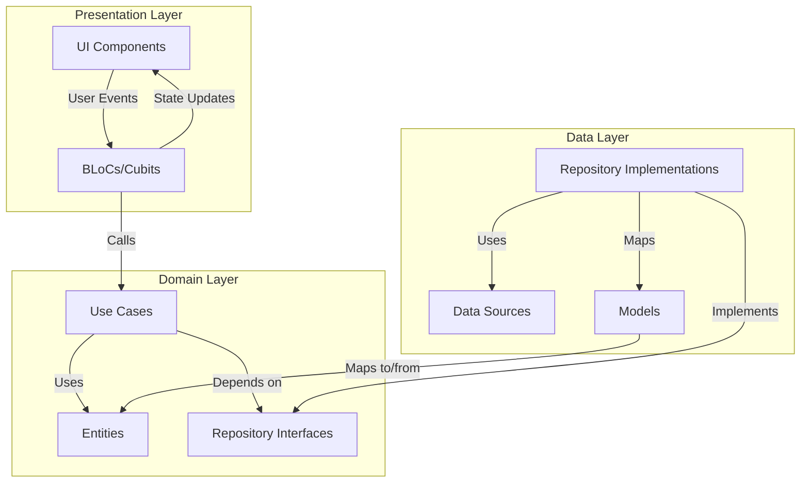

## Block Type Hierarchy

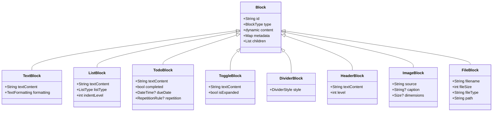

## Document Structure

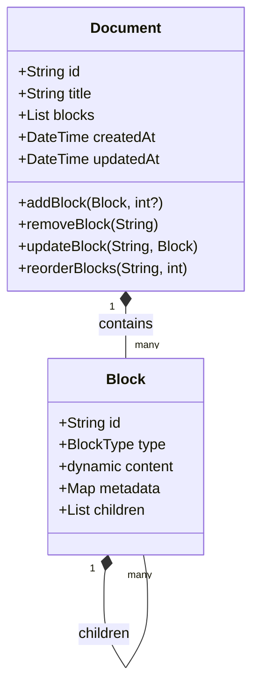

## State Management Flow

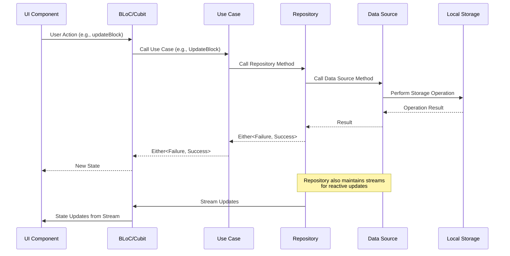

## Command Palette Flow

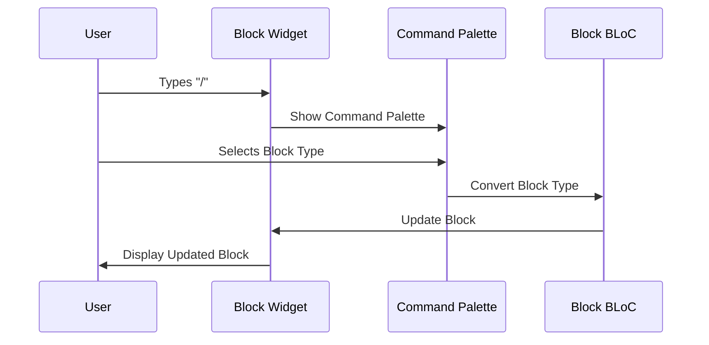

## Todo Repetition Flow

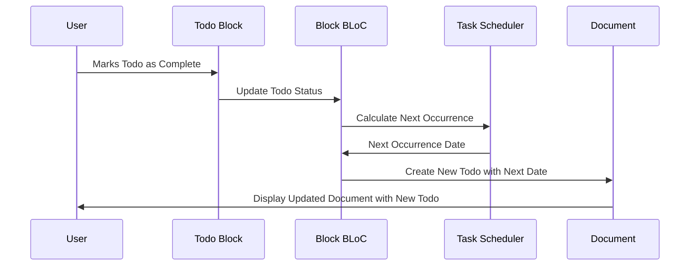

## Data Layer Implementation

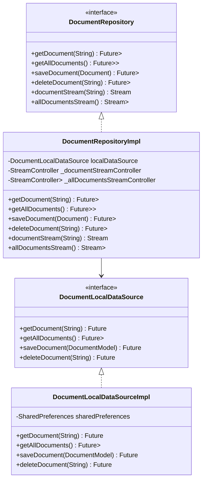

## Presentation Layer Implementation

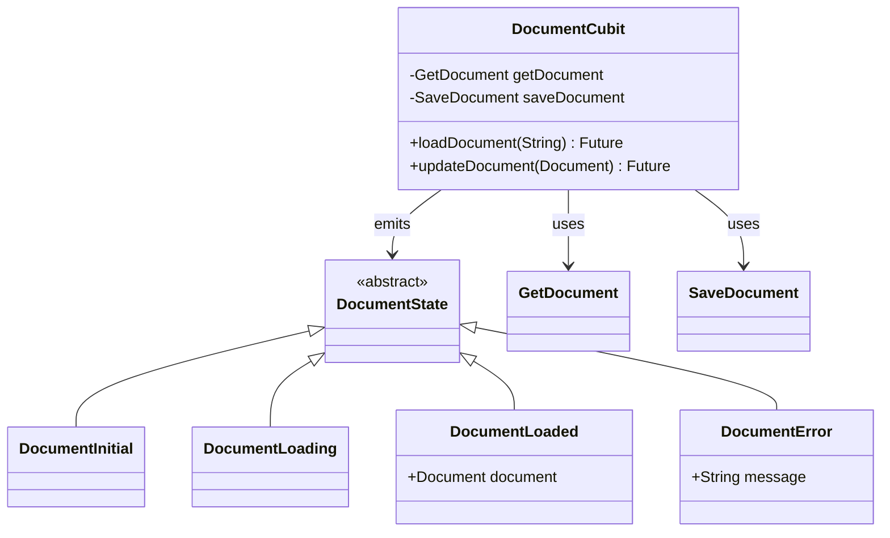

## Widget Hierarchy

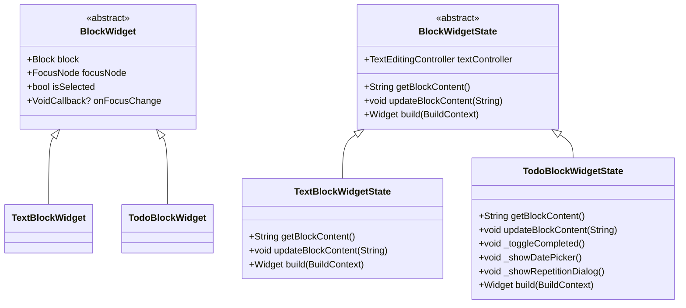

## Dependency Injection

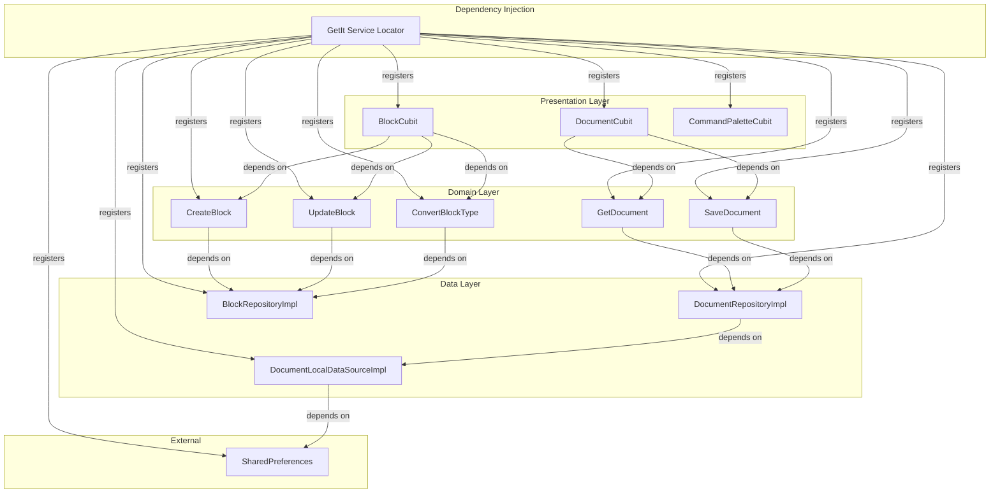

## User Interface Layout

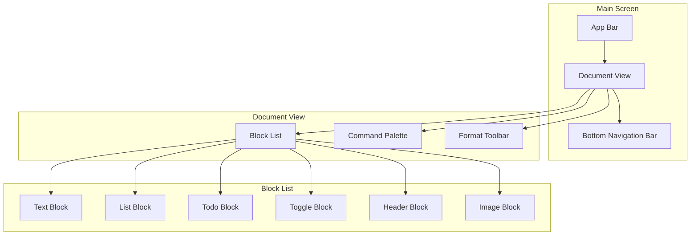

These diagrams provide a visual representation of the Gradus application architecture, showing the relationships between different components and the flow of data through the system.
